# Testes de Carga - WordPress Distribuido + Locust

Projeto da disciplina de **Computacao Distribuida** para avaliar o comportamento de uma arquitetura WordPress com escalabilidade horizontal atras de um balanceador Nginx, sob diferentes niveis de concorrencia.

## Grupo C

| Integrante | Matricula |
|---|---|
| Caio Barros | 2315082 |
| Leonardo de Saboia | 2310333 |
| Gustavo Sousa | 2315053 |
| Kaíke Petalas | 2310331 |

## Objetivo

Responder, com dados, a pergunta:

> Adicionar mais replicas de WordPress melhora desempenho em qualquer carga?

O experimento mostra que **depende do gargalo ativo**.

## Arquitetura testada

```text
Usuarios (Locust) -> Nginx (load balancer) -> N replicas WordPress -> MySQL unico
```

Componentes principais:

- `Locust`: gera a carga sintetica (porta `8089`).
- `Nginx 1.19`: distribui requisicoes em round-robin na porta `80`.
- `WordPress`: escalado com `docker compose up --scale wordpress=N`.
- `MySQL 5.7`: instancia unica compartilhada por todas as replicas.

Pontos importantes da configuracao:

- Descoberta dinamica de replicas no Nginx com `resolver 127.0.0.11` (DNS interno do Docker).
- Volume compartilhado `wordpress_data` para os arquivos servidos pelos posts.
- Ambiente executado em Docker Desktop + WSL2.

## Cenarios de teste

| Cenario | Tipo de conteudo | Tamanho aproximado | URL |
|---|---|---|---|
| 1 | Imagem | ~1 MB | `/2026/04/28/teste-forte/` |
| 2 | Texto (Lorem Ipsum) | ~400 KB | `/2026/04/28/teste-fraco/` |
| 3 | Imagem | ~300 KB | `/2026/04/28/teste-medio/` |
| 4 | Hibrido (round-robin entre 1, 2 e 3) | Misto | Todas acima |

Matriz de execucao:

- Instancias WordPress: `1`, `3`, `5`
- Usuarios simultaneos: `200`, `600`, `1200`
- Total: `36` combinacoes (`4 cenarios x 3 instancias x 3 cargas`)

## Estrutura relevante do repositorio

```text
.
|-- docker-compose.yml
|-- nginx/nginx.conf
|-- locust/locustfile.py
|-- locust/analise.ipynb
|-- locust/resultados/
|-- analise.md
`-- README.md
```

## Como reproduzir

### 1) Subir ambiente inicial e criar posts

```bash
docker compose up -d --scale wordpress=1
```

Criar no WordPress (`http://localhost/wp-admin`) os posts:

- `teste-forte`: imagem ~1 MB
- `teste-fraco`: texto ~400 KB
- `teste-medio`: imagem ~300 KB

Se os slugs mudarem, ajustar no `locust/locustfile.py`.

### 2) Escalar aplicacao

```bash
docker compose up -d --scale wordpress=1
docker compose up -d --scale wordpress=3
docker compose up -d --scale wordpress=5
```

### 3) Rodar carga via interface do Locust

```bash
docker compose up -d --scale wordpress=N
# abrir http://localhost:8089
```

### 4) Rodar lote completo automaticamente

```bash
chmod +x locust/run_tests.sh
./locust/run_tests.sh
```

Arquivos gerados em `locust/resultados/`:

- `cenario{N}_{I}inst_{U}u_stats.csv`
- `cenario{N}_{I}inst_{U}u_stats_history.csv`

No Windows/PowerShell, voce tambem pode usar:

```powershell
./locust/run_tests.ps1
```

### 5) Analisar resultados

```bash
jupyter notebook locust/analise.ipynb
```

Analise textual complementar: `analise.md`.

### 6) Derrubar ambiente

```bash
docker compose down
docker compose down -v
```

## Resumo executivo dos resultados

- **200 usuarios:** cenarios 2, 3 e 4 estaveis; cenario 1 piora com mais replicas (efeito de contencao).
- **600 usuarios:** faixa em que escalar WordPress ajuda de forma consistente (ganhos modestos de throughput e latencia).
- **1200 usuarios:** colapso com alta taxa de falha em qualquer numero de replicas; gargalo dominante no MySQL unico.

## Graficos e analise detalhada

### 1) Visao geral por usuarios

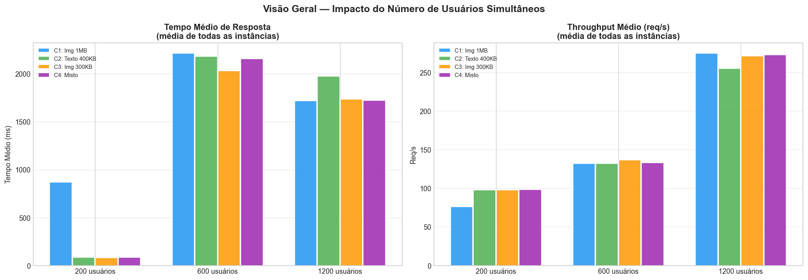

Leitura:

- Mostra consolidado de desempenho quando variamos `200`, `600` e `1200` usuarios.
- O salto de falhas aparece concentrado em `1200` usuarios.

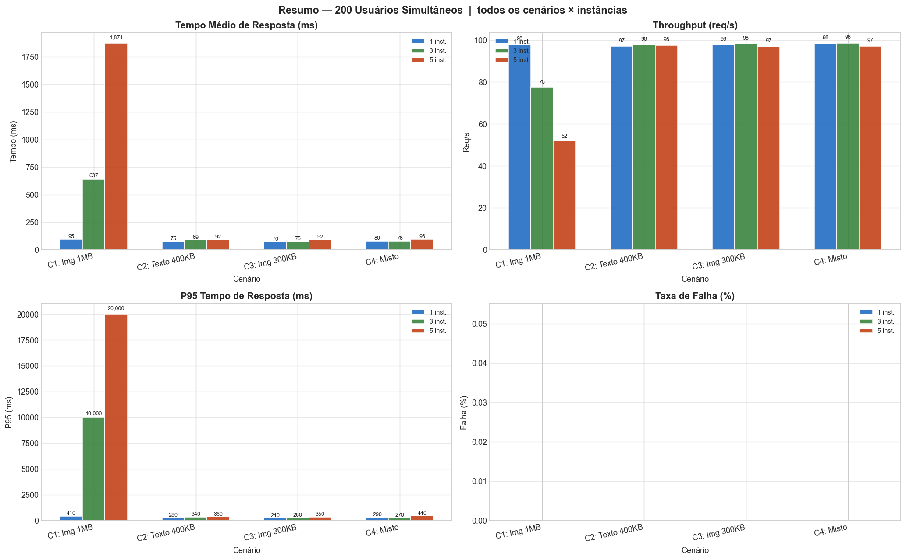

Leitura:

- Em `200` usuarios, o sistema fica confortavel para payloads medio/pequeno.
- A anomalia principal surge no cenario de 1 MB com multiplas replicas.

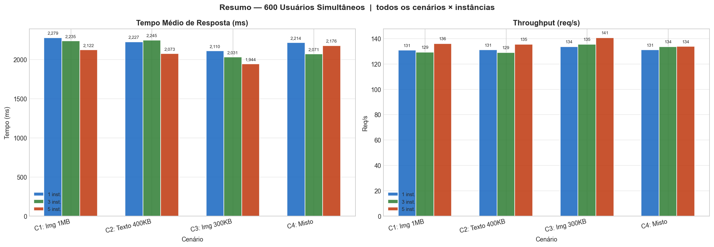

Leitura:

- Em `600` usuarios, escalar para 3 e 5 instancias tende a reduzir latencia e manter estabilidade.
- E a faixa mais representativa de ganho horizontal neste ambiente.

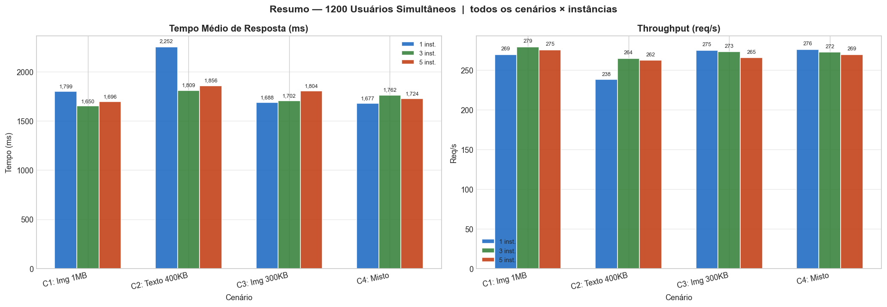

Leitura:

- Em `1200` usuarios, observa-se saturacao geral.
- Mais replicas de WordPress nao removem o gargalo de banco.

### 2) Visao geral por instancias

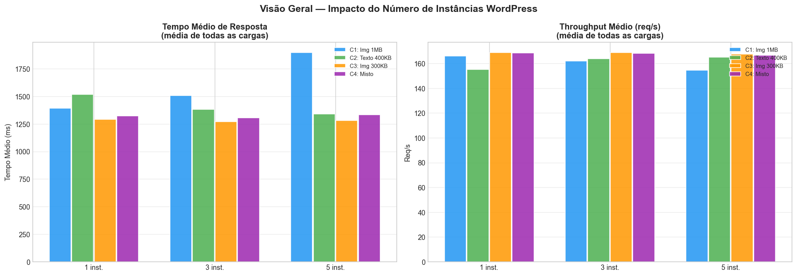

Leitura:

- Consolidado por `1`, `3` e `5` instancias.
- Ganho nao e linear porque o banco continua unico.

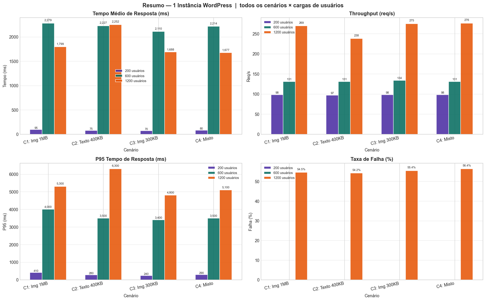

Leitura:

- Baseline do ambiente sem escalabilidade horizontal.
- Serve para comparar ganho/perda das demais configuracoes.

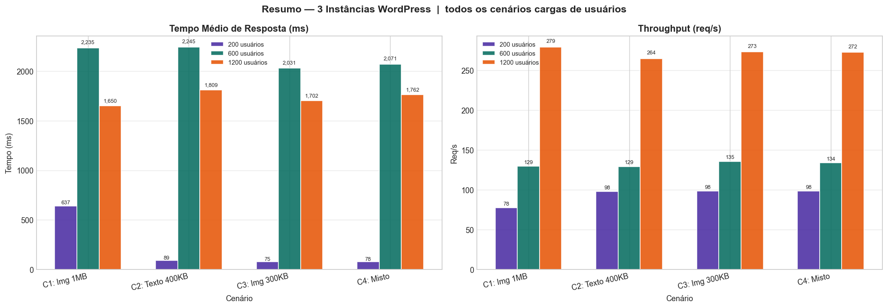

Leitura:

- Normalmente traz melhora em carga intermediaria.
- Ja sob carga extrema, herda o mesmo limite estrutural do MySQL.

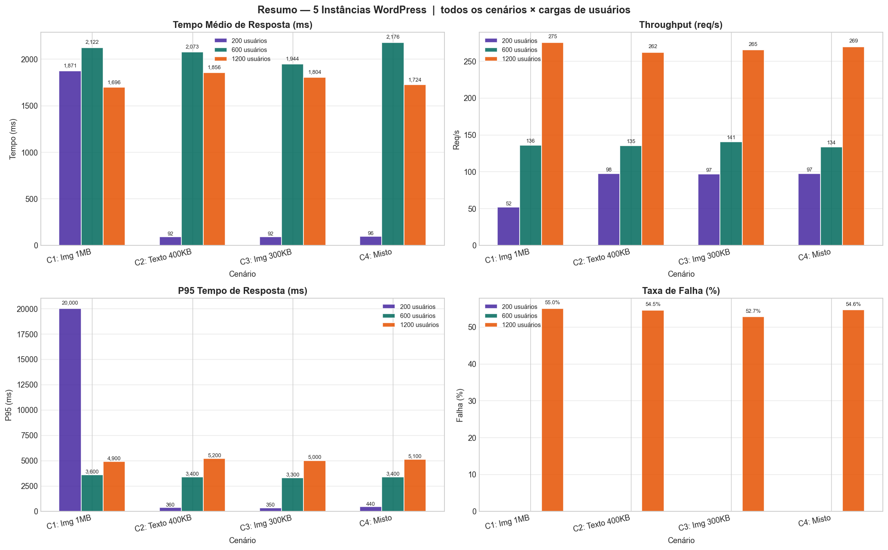

Leitura:

- Maior potencial de distribuicao na camada web.
- Sem escalar banco/cache, o ganho total segue limitado.

### 3) Latencia e percentis

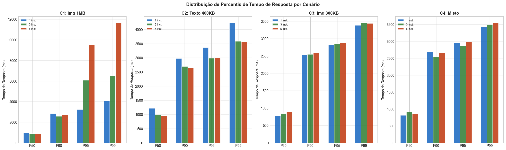

Leitura:

- Diferenca entre latencia tipica (P50) e cauda (P95/P99).
- A cauda cresce forte quando o sistema se aproxima da saturacao.

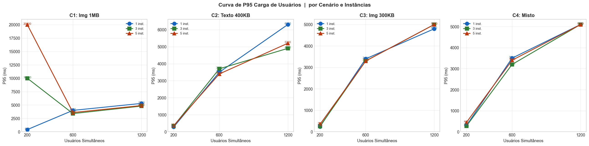

Leitura:

- Evolucao do P95 ao longo da carga.
- Destaca degradacao de experiencia antes mesmo do colapso total.

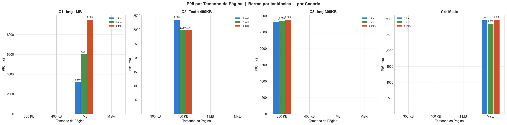

Leitura:

- Compara impacto de payload grande vs medio/pequeno por numero de replicas.
- Explica por que o cenario de 1 MB e mais sensivel a contencao.

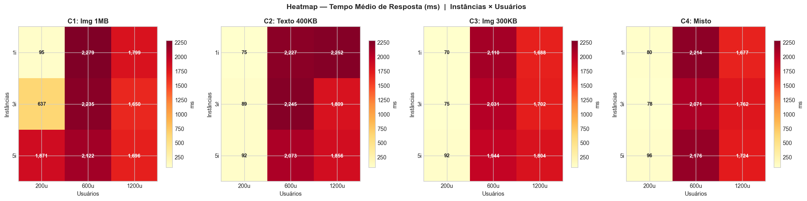

Leitura:

- Mapa de calor deixa visivel as combinacoes com maior tempo medio.
- Regioes criticas concentram-se em alta concorrencia.

### 4) Falhas e estabilidade

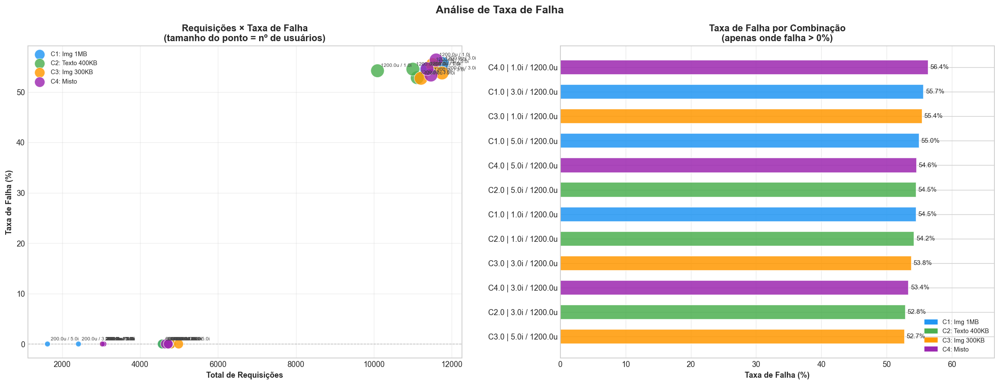

Leitura:

- Falha proxima de zero em cargas leves/medias.
- Forte aumento em carga alta, independentemente das replicas web.

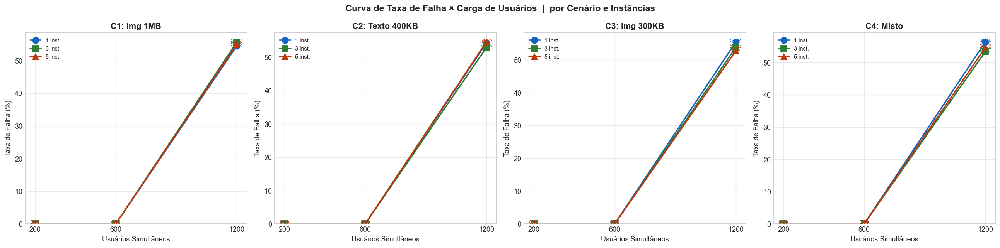

Leitura:

- Crescimento de erros acompanha saturacao dos recursos compartilhados.
- Indicador importante de limite operacional.

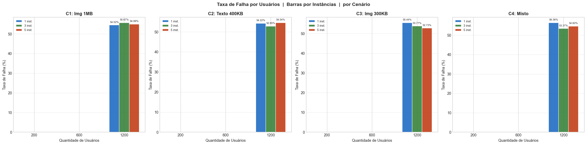

Leitura:

- Compara diretamente o percentual de erro entre cargas e escalas.
- Reforca que o principal limitador final e o banco single-node.

## Conclusao

Escalabilidade horizontal de WordPress **ajuda**, mas apenas enquanto o gargalo principal ainda esta na camada web. Quando a carga sobe para `1200` usuarios, o gargalo muda para o MySQL unico e as replicas adicionais perdem efetividade.

Proximos passos tecnicos para evolucao da arquitetura:

1. Escalar camada de dados (replicas de leitura, tuning de conexoes, ou banco distribuido).
2. Adicionar cache de objetos/paginas (ex.: Redis) para reduzir pressao no MySQL.
3. Definir limites de CPU/memoria por container e revisar tuning de Apache/Nginx para reduzir contencao.
